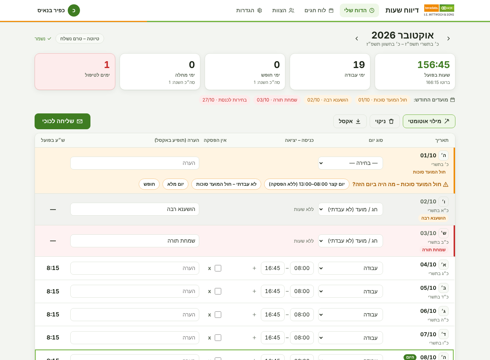

<div dir="rtl">

# דיווח שעות – אתר לצוות

אתר פשוט למילוי דיווח השעות החודשי ולשליחתו לכוכי (kohava@ncr.co.il) בלחיצת כפתור.
האתר מייצר את **אותו קובץ אקסל** שאנחנו שולחים היום (גיליון "נוסח 1" עם אותן נוסחאות) ופותח מייל מוכן באאוטלוק – נשאר רק ללחוץ **Send**.



## מה יש באתר

- **הדוח שלי** – שורה לכל יום: סוג יום (עבודה / חופש / מחלה / חצי יום / מילואים / יום בחירה / חג...), כניסה–יציאה (כולל יום מפוצל), "אין הפסקה" (x) והערה.
  החישוב זהה לנוסחאות בגיליון: `ש"ע בפועל = ברוטו − 0:30`, בלי קיזוז בשישי–שבת או כשמסומן x.
- **מילוי אוטומטי** – ממלא את ימי א׳–ה׳ ב-08:00–16:45, רושם את שמות החגים, ולא דורס ימים שכבר מולאו.
- **חגים וערבי חג** – הלוח העברי מחושב אוטומטית, והמילוי האוטומטי עובד לפי הנוהל:
  - **חג וערב חג** (כולל הושענא רבה וערב שביעי של פסח) – לא עובדים, ולא נספר כיום חופש. נרשם שם החג.
  - **חול המועד** – לא ממולא אוטומטית: היום מסומן בכתום עם השאלה "מה היה ביום הזה?" ושלושה כפתורים –
    "עבדתי 08:00–13:00" (עם x ב"אין הפסקה"), "לא עבדתי" ו"יום מלא". **יום בחוה"מ שלא עבדו בו נספר בסיכומים כחצי יום חופש** (מוצג "½ חופש").
  - **תשעה באב** – 08:00–13:00 ללא הפסקה.
  - אפשר לשנות כל יום ידנית, ואת הנוהל עצמו במסך ההגדרות. מועדים מיוחדים (למשל **בחירות 27/10/2026**) מוגדרים שם.
- **שמירה אוטומטית** – כל שינוי נשמר מיד (גם בפרופיל ובהגדרות), עם חיווי "שומר… / נשמר". גם סגירת הלשונית רגע אחרי שינוי לא מאבדת אותו.
- **בדיקת תקינות לפני שליחה** – ימים חסרים, שעות לא הגיוניות, חול המועד שלא נבחר.
- **שליחה לכוכי** – נושא `דווח שעות ספטמבר 2026 - כפיר בנאיס`, ברכה שמתחלפת כל חודש, והאקסל מצורף.
  האתר מוריד קובץ `‎.eml` שנפתח באאוטלוק כהודעה מוכנה.
- **היסטוריה** – כל החודשים, מה נשלח ומה לא, והורדת אקסל לכל חודש. חודש שנשלח נוצר מחדש **בדיוק כמו שנשלח** (השם וזמן ההפסקה נשמרים ברגע השליחה).
- **תזכורת** – באנר מיום העבודה הראשון בחודש עד ששולחים, וקובץ ליומן עם תזכורת חודשית.
- **לוח חגים** לשנה הקרובה.
- **מסך צוות (למנהל)** – מי שלח, שעות, חופש/מחלה, אקסל של כל עובד, ובקשות "שכחתי סיסמה".
- **כניסה עם המייל של החברה** – הרשמה רק עם `@ncr.co.il`, בלי קודים ובלי המתנה.
- מותאם לטלפון ולמצב כהה, בעיצוב NCR.

### שכחתי סיסמה (בלי שרת מייל)

1. העובד לוחץ "שכחתי סיסמה" ומזין את המייל.
2. אצל מנהל הצוות מופיע מספר ליד "הצוות", ובמסך הצוות – "בקשות שמחכות לך".
3. המנהל לוחץ **"שליחת קישור איפוס"** ← **"פתיחת מייל באאוטלוק"** – נפתח מייל מהאאוטלוק שלו לעובד עם קישור חד-פעמי (24 שעות).
4. העובד פותח את הקישור ובוחר סיסמה חדשה. המנהל לא רואה את הסיסמה.

## הקמה על שרת Windows (בלי Git על השרת)

צריך: Windows Server (או Windows 10/11) ברשת המשרד, עם הרשאות מנהל.

**1. במחשב שלך – להוריד את חבילת ההתקנה:**
בדף [Releases](https://github.com/KfirBenais/MittwochHourReport/releases/latest) מורידים את `HoursReport-<גרסה>.zip`.
(אפשר גם מדף הריפו: Code ← Download ZIP – זה עובד אותו דבר.)

**2. בשרת – להתקין Node.js (פעם אחת):** מ-[nodejs.org](https://nodejs.org) גרסת LTS (קובץ MSI, "הבא-הבא"), או ב-PowerShell: `winget install OpenJS.NodeJS.LTS`.

**3. בשרת – להעתיק את ה-ZIP, לחלץ (למשל ל-Downloads), ולהריץ ב-PowerShell כמנהל מתוך התיקייה שחולצה:**

```powershell
powershell -ExecutionPolicy Bypass -File .\install-windows.ps1
```

הסקריפט מעתיק את האתר ל-`C:\HoursReport`, פותח את פורט 8080 ב-Firewall של Windows, רושם משימה שמפעילה את האתר עם עליית השרת
(בלי שמישהו מחובר) ומפעילה אותו מחדש אם נפל, ובודק שהאתר עונה. בסוף הוא מדפיס את הכתובות, למשל `http://hours-srv:8080`.

- פורט אחר (אם 8080 תפוס): `.\install-windows.ps1 -Port 8081`
- תיקייה אחרת: `.\install-windows.ps1 -InstallDir D:\Apps\HoursReport`

**4. להתחבר מהמחשב שלך:** לפתוח בדפדפן את הכתובת שהודפסה. **מי שנרשם ראשון הופך למנהל הצוות.**
אם לא נפתח – לוודא שהפורט פתוח ברשת בין המחשבים לשרת (Firewall של החברה).
מספר הגרסה המותקנת מופיע בתחתית האתר.

**עדכון גרסה:** מורידים ZIP חדש, מחלצים בשרת ומריצים את אותה פקודה. הנתונים (`C:\HoursReport\data`) וההגדרות (`config.json`) לא נדרסים.

**הסרה:** `.\install-windows.ps1 -Uninstall` (התיקייה עם הנתונים נשארת).

**הרצה ידנית לבדיקה** (בלי להתקין כשירות): לחיצה כפולה על `start.bat`.

**פרסום גרסה חדשה (למפתח):** מעדכנים את `version` ב-`package.json` ודוחפים ל-`main`.
GitHub מריץ את הבדיקות, בונה את ה-ZIP ומפרסם אותו ב-Releases אוטומטית.

### צ'קליסט לבדיקה ראשונה

- [ ] נרשמתי ראשון ← אני מנהל (רואה "הצוות" ו"הגדרות").
- [ ] מחשב אחר נרשם עם מייל `@ncr.co.il` (ומייל אחר נדחה).
- [ ] מילוי אוטומטי לחודש קודם ← הסכום זהה לאקסל הידני.
- [ ] "שליחה לכוכי" ← קובץ ה-eml נפתח באאוטלוק עם האקסל מצורף (לבדיקה: לשנות זמנית את הנמען לעצמי בהגדרות).
- [ ] "שכחתי סיסמה" ← הבקשה מופיעה במסך הצוות ← קישור ← סיסמה חדשה עובדת.
- [ ] כיבוי והדלקה של השרת ← האתר עולה לבד.
- [ ] עדכון: הרצת הסקריפט מ-ZIP חדש ← הגרסה בתחתית האתר מתעדכנת והנתונים נשארים.

## כתובת עם שם משמעותי (למשל `http://hours:8080`)

כברירת מחדל נכנסים בשם השרת, למשל `http://slika:8080`. כדי שהכתובת תהיה עם שם שמסביר מה זה,
מבקשים ממי שמנהל את ה-DNS של החברה (בדרך כלל ה-IT) **רשומת CNAME (כינוי)** – למשל בשם `hours` – שמצביעה על השרת.
מי שיש לו הרשאה יכול להריץ על שרת ה-DNS:

```powershell
Add-DnsServerResourceRecordCName -ZoneName "<דומיין הרשת>" -Name "hours" -HostNameAlias "<שם השרת המלא>"
```

באתר עצמו לא צריך לשנות כלום – הוא עונה לכל שם שמצביע על השרת. הכתובת הישנה ממשיכה לעבוד
(בכתובת החדשה מתחברים פעם אחת מחדש). כדי שגם חלון השרת יציג את הכתובת החדשה: `"publicUrl": "http://hours:8080"` ב-`config.json`.

## פתיחה אוטומטית של המייל באאוטלוק

אתר לא יכול לפתוח את אאוטלוק עם קובץ מצורף (קישור `mailto` לא תומך בצירוף קבצים), ולכן המייל לכוכי יורד כקובץ `.eml`.
הגדרה חד-פעמית בדפדפן (Chrome / Edge) גורמת לו להיפתח באאוטלוק מיד:

1. בכתובת `chrome://settings/downloads` (או `edge://settings/downloads`) – לכבות את **"Ask where to save each file before downloading"**.
2. אחרי ההורדה הבאה של מייל: בסמל ההורדות (Ctrl+J) – קליק ימני על הקובץ ← **"Always open files of this type"**.

ההוראות מופיעות גם בחלון השליחה באתר.

## הגדרות (לא חובה)

בלי שום קובץ הגדרות האתר עובד בפורט 8080 ורק עם מיילים של `ncr.co.il`.
לשינוי: מעתיקים את `config.example.json` ל-`config.json`, מעדכנים ומריצים שוב את `install-windows.ps1`.
אפשר גם HTTPS עם תעודת pfx (בקובץ ההגדרות).

## נתונים וגיבויים

הכול נשמר בקובץ אחד: `data\db.json` (סיסמאות מוצפנות ב-scrypt). אין צורך במסד נתונים.
גיבוי יומי אוטומטי ל-`data\backups\` (30 הימים האחרונים). לוגים ב-`data\logs\`.
לשחזור: עוצרים (`Stop-ScheduledTask HoursReport`), מעתיקים גיבוי במקום `db.json`, ומפעילים (`Start-ScheduledTask HoursReport`).
מומלץ לגבות את תיקיית `data` גם לכונן אחר.

## בדיקות (למפתחים)

```bash
npm test
```

כוללות: כל החגים 2024–2036 מול ספריית hebcal; הסכומים של הקבצים האמיתיים (יוני 181:30, יולי 178:15, אוגוסט 140:15, ספטמבר 107:15);
מבנה האקסל וקובץ ה-eml; הרשמה, הרשאות, "שכחתי סיסמה" ושמירת הפרטים בזמן השליחה.

## מבנה הקוד

| קובץ | תפקיד |
|---|---|
| `server.js` | שרת Node ללא תלויות: קבצים סטטיים, API, כניסה, אחסון JSON |
| `install-windows.ps1`, `run-server.cmd` | התקנה/עדכון כשירות קבוע ב-Windows |
| `.github/workflows/release.yml` | בניית חבילת ההתקנה (ZIP) לכל גרסה |
| `public/js/calendar.js` | לוח עברי וחגי ישראל |
| `public/js/report.js` | סוגי ימים, חישוב שעות (כמו באקסל), מילוי אוטומטי, בדיקות |
| `public/js/excel.js` | יצירת האקסל לפי תבנית "נוסח 1" (ExcelJS) |
| `public/js/email.js` | נושא, ברכות, קובץ eml, תזכורת ליומן |
| `public/js/month.js`, `history.js`, `send.js`, `admin.js`, `auth.js`, `app.js` | המסכים |
| `mailer.js` | (לא בשימוש כברירת מחדל) שליחת מיילים מהשרת, אם בעתיד יוגדר שרת מייל |

ExcelJS (רישיון MIT) נמצא ב-`public/vendor` כדי שהאתר יעבוד גם בלי אינטרנט.

</div>
